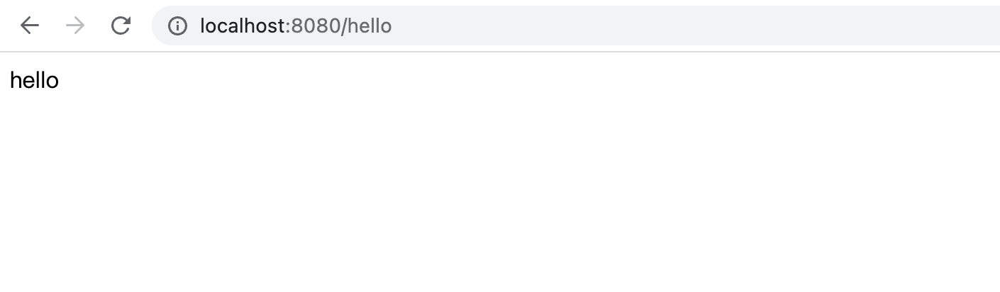
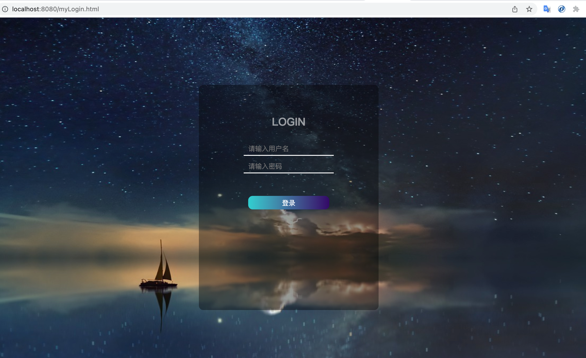

# 1. spring security 快速体验

pom.xml依赖

```xml
<!--spring-boot相关依赖自动导入 -->
<dependencyManagement>
        <dependencies>
          <dependency>
            <groupId>org.springframework.boot</groupId>
            <artifactId>spring-boot-dependencies</artifactId>
            <version>2.5.4</version>
            <type>pom</type>
            <scope>import</scope>
          </dependency>
    </dependencies>
</dependencyManagement>
<dependencies>
      <!-- 导入web依赖 -->
      <dependency>
        <groupId>org.springframework.boot</groupId>
        <artifactId>spring-boot-starter-web</artifactId>
      </dependency>
			<!-- 导入security依赖 -->
      <dependency>
        <groupId>org.springframework.boot</groupId>
        <artifactId>spring-boot-starter-security</artifactId>
      </dependency> 
    
</dependencies>
```


编写代码

```java
package com.xujia;

import org.springframework.boot.SpringApplication;
import org.springframework.boot.autoconfigure.SpringBootApplication;
import org.springframework.web.bind.annotation.RequestMapping;
import org.springframework.web.bind.annotation.RestController;

@RestController
@SpringBootApplication
public class SpringSecurityApplication
{
    public static void main( String[] args )
    {
        System.out.println( "Hello World!" );
        SpringApplication.run(SpringSecurityApplication.class);
    }


    @RequestMapping("/hello")
    public String hello(){
        return "hello";
    }
}
```


启动运行

访问 http://localhost:8080/hello, 结果看到页面自动跳转到spring-security提供的默认登陆页面上。


在spplication.yml中指定用户和密码

```yaml
spring:
  # Spring Security 配置项，对应 SecurityProperties 配置类
  security:
    # 配置默认的 InMemoryUserDetailsManager 的用户账号与密码。
    user:
      name: user # 账号
      password: user # 密码
      roles: ADMIN # 拥有角色
```

输入密码之后，我们就可以正常访问到原来指定的地址了。



## 1.2 配置认证信息

默认的的表单认证

查看WebSecurityConfigurerAdapter类的configure(HttpSecurity http)方法，如下：
```java

@Override
protected void configure(HttpSecurity http) throws Exception {
		this.logger.debug("Using default configure(HttpSecurity). "
				+ "If subclassed this will potentially override subclass configure(HttpSecurity).");
		http.authorizeRequests((requests) -> requests.anyRequest().authenticated());
		http.formLogin();
		http.httpBasic();
	}
```


在这个方法中，分别做了以下三件事

- 验证请求
- 允许用户使用表单进行身份验证
- 允许用户使用HTTP基本认证


## 1.3 自定义表单登陆页

  在实际开发中，肯定会有需要定制化的登陆页面，因此在spring security支持自定义的表单登陆页面式必须的。

  继续看WebSecurityConfigurerAdapter类的configure(HttpSecurity http)方法，我们可以同时指定登陆页面的情况。
```java
    @Override
    protected void configure(HttpSecurity http) throws Exception {
        // 自定义登录表单信息
        http.authorizeRequests()
                .anyRequest().authenticated()
                .and()
                .formLogin()
                // 指定登陆页面
                .loginPage("/myLogin.html")
                // 登陆页面不设限访问
                .permitAll()
                .and()
                .csrf().disable();
    }
```

创建登陆页面，在static目录下新增一个文件myLogin.html,(这里省略样式文件， 随便搜索一个登陆页面即可)
```html
<body>
<form method="post" action="/myLogin.html">
  <div id="login_box">
    <h2>LOGIN</h2>
    <div id="input_box">
      <input type="text" placeholder="请输入用户名" name="username">
    </div>
    <div class="input_box">
      <input type="password" placeholder="请输入密码" name="password">
    </div>
    <button type="submit">登录</button><br>
  </div>
</form>

</body>
</html>
```


再次访问 http://localhost:8080/hello 即可跳转到自定义的页面上。



